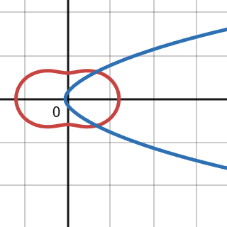
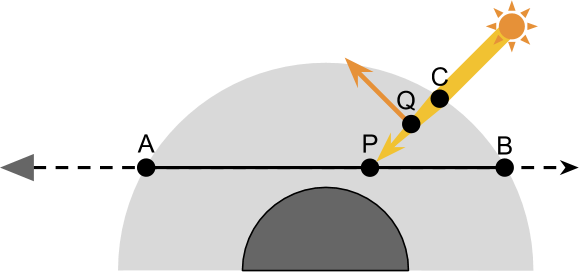
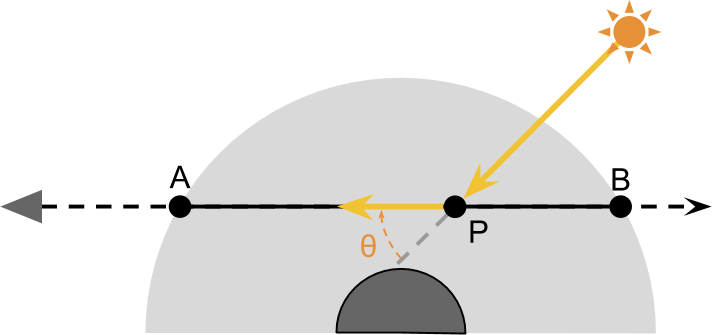
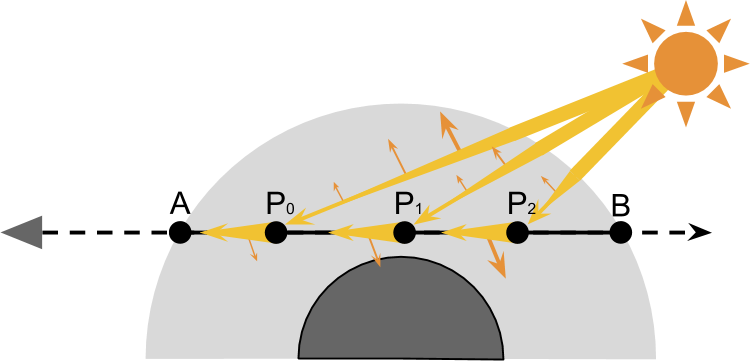
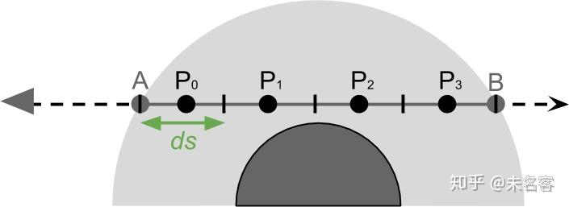
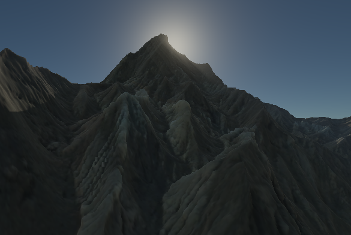

主要是根据这位大佬的文章进行学习：[从零实现一套完整单次大气散射](https://zhuanlan.zhihu.com/p/237502022)  
值得注意的是，因为是RealTime，所以做了多近似与妥协，离线或许就可以完整进行所有数据的精确计算了
# 一、理论

## 1、概念
**散射**：光线在碰到空气中的分子时，会向四面八方发生散射。可理解为光在当前传播方向上散射后会有能量损失

**大气组成**：按照当前的需要，认为大气中的颗粒分为粒径远小于波长的分子/小粒子，其发生Rayleigh 散射；粒径与波长同量级或更大的气溶胶颗粒，其发生Mie散射

**大气密度**：大气并非均匀介质，密度与海拔相关

## 2、需要用到的方程
### 2.1 散射方程  The Scattering Function

$S(\lambda, \theta, h)$

**含义**：一个比例，表示波长$\lambda$的光，在 h 海拔下，散射到$\theta$角度的比例。因为散射向各个方向，但我们只会关心入射到眼睛（相机）的方向

**表示**：
$S(\lambda, \theta, h) = \frac{\pi^2(n^2-1)^2}{2} \underbrace{\frac{\rho(h)}{N}}_{\text{density}} \overbrace{\frac{1}{\lambda^4}}^{\text{wavelength}} \underbrace{(1 + \cos^2 \theta)}_{\text{geometry}}$
>这并不是真正的Rayleigh散射方程，但实际实现并不使用这个公式，后面会具体总结

### 2.2 散射系数  Scattering Coefficient

$\beta\ (\lambda,h)$

**含义**：散射方程是在一个方向上散射比例，散射系数是在所有方向散射掉的总比例，理解为因散射而丢失的能量的比例，或者是偏离原来传播方向比例

单位通常是 1/m 表示前进1m 散射的比例

**求法**：对散射方程做球面积分

**结果**：  
Rayleigh散射：
$\beta(\lambda, h) = \frac{8\pi^3 (n^2-1)^2}{3} \frac{\rho_r(h)}{N} \frac{1}{\lambda^4}$

Mie散射：
$\beta(\lambda, h) = \beta(\lambda, 0) \rho_m(h)$

>这个很重要，但是实际实现也不会使用

补充：

$\beta$ 与 $\lambda^4$ 乘反比，也能解释 白天天空为蓝色，夕阳为橙红色：蓝光被散射强（朝四面八方散射），红光直接穿透大气，因此白天天空进入眼睛的颜色大多是蓝色（也因为视网膜对相对紫光，对蓝光的敏感度更高）。夕阳是因为穿过大气层的厚度变大，蓝紫光几乎全被散射，只有红光等长波长光能穿透过来<br>
$\rho_m(h)$ 马上说

### 2.3 海平面处的rayleigh 散射系数 

通常计算时，会进行简化计算，这里要说的是：
$\beta(\lambda, h) = \beta(\lambda)\rho(h)$ 

$\beta(\lambda)$ 表示的是 海平面处(h = 0)的散射系数，
Rayleigh： 
$\beta(\lambda) = \frac{8\pi^3 (n^2-1)^2}{3} \frac{1}{N} \frac{1}{\lambda^4}$

同时Mie 散射 的散射系数复杂，具体参见大佬的文章，这里就不写了

实际实现的时候，使用这两个量
:::note
$\beta_r(440, 550, 680) = (33.1, 13.5, 5.8) * 10^{-6}$  
$\beta_m(440, 550, 680) = (2.2, 2.2, 2.2) * 10^{-5}$
:::
440、550、680nm 表示的蓝 绿 红光的波长。
>选这三个似乎是有标准的，似乎是使用两个不同波长进行气溶胶颗粒的推算，
>瑞利的散射系数不同 符合随波长变化的规律
>而Mie 散射是散射系数随波长变化弱得多，这里的量认为不变

### 2.4 相位函数 Phase Function

$\gamma(\theta)$

**含义**：在所有散射方向中，某个方向的所占的具体比例
也就是  $\gamma(\theta)=\frac{S(\lambda, \theta, h)}{\beta(\lambda, h)}$  
**公式**：<br>
$\gamma_r(\theta) = \frac{3}{16\pi} (1 + \cos^2 \theta)$ <br>
$\gamma_m(\theta) = \frac{1-g^2}{4\pi(1+g^2-2g\cos(\theta))^{\frac{3}{2}}}$
>其中Mie的相位函数中，g为各项异性系数，通常取0.76

两个相位函数图像（红色为R，蓝色为M）：
[Desmos](https://www.desmos.com/calculator/emvyohh9zc)

>其中也可以注意到Rayleigh 前后对称，0°/180° 最强，90° 最弱，
>而Mie 更倾向于向前散射，而几乎不向后散射

### 2.5 大气密度比例方程 Atmospheric Density Ratio

$\rho(h)$

**含义**：描述了海拔h米处，经过归一化以后大气的测量值，常被表示为：<br>
$\rho(h) = \frac{density(h)}{density(0)}$<br>
但$density(h)$  因各种因素非常难求，但好在Rayleigh ，Mie 散射，发生在较低的大气层中，范围内，大气密度是遵循随着高度指数衰减的，可以用一条曲线，来近似：<br>
$\rho(h) = \exp\left\{ -\frac{h}{H} \right\}$

>其中H为常量  
>Rayleigh :H= 8500m  
>Mie :H = 1200

### 2.6 指数衰减
当光线与粒子发生碰撞时，会发生散射，即丢失一部分能量  
假设在经过距离为1m的介质散射前，光线的能量为$I0$，散射后能量$I1$，则有：
$I_1 = \underbrace{I_0}_{\text{initial energy}} - \underbrace{I_0 \beta}_{\text{energy lost}} = I_0 (1 - \beta)$

假设 光线在散射系数为$\beta$ 的均匀介质内，传播一小段距离x后，剩余能量：
<br>$I = I_0 \exp \{ -\beta x \}$<br>

推导：
若x距离内仅发生一次碰撞：
$I_1 = I_0 (1 - \beta x)$
若发生两次碰撞，则有：
<br>$I_2 = \boxed{I_1} \left( 1 - \frac{\beta x}{2} \right)$<br>
$\boxed{I_2 = I_0 \left( 1 - \frac{\beta x}{2} \right)} \left( 1 - \frac{\beta x}{2} \right) = I_0 \left( 1 - \frac{\beta x}{2} \right)^2$<br>
则n个点：
<br>$I = \lim_{n \to \infty} I_0 \left( 1 - \frac{\beta x}{n} \right)^n$<br>
$\lim_{n \to \infty} \left( 1 - \frac{\beta x}{n} \right)^n = e^{-\beta x} = \exp \{ -\beta x \}$

>代表了在每一小段距离x/n 内，$\beta$ 散射系数的介质，进行散射后的剩余

但时$\beta$ 不是常数，大气密度不同位置是变化的，因此要进行积分，步进，做RayMarch
### 2.7 大气透射率


>来源：[www.alanzucconi.com](https://www.alanzucconi.com/2017/10/10/atmospheric-scattering-1/)

看图，太阳光 到达大气顶部C点，进入大气后沿着原来的方向，打到P点，此时衰减后的能量为$I_p$ ,现在的目标是计算这个值

>值得注意的时，大气不是均匀介质，密度随着海拔高度一直在变。

**推导**：

把 $\overline{CP}$分两段，$\overline{CQ}$ 和$\overline{QP}$。这两段内，各自的密度是恒定的，取他们各自中点的散射数，那么各自的散射系数分别是 $\beta(\lambda, h_0)$ 和 $\beta(\lambda, h_1)$。

带入2.6，有：<br>
$I_Q = I_S \exp \left\{ -\beta(\lambda, h_0) \overline{CQ} \right\}$<br>

$I_P = \boxed{I_Q} \exp \left\{ -\beta(\lambda, h_1) \overline{QP} \right\}$<br>

$I_P = \boxed{I_S \exp \{ -\beta(\lambda, h_0) \overline{CQ} \}} \exp \{ -\beta(\lambda, h_1)\overline{QP} \}  = I_S \exp \{ -\beta(\lambda, h_0) \overline{CQ} - \beta(\lambda, h_1) \overline{QP} \}$<br>

$\overline{CQ}$ 和 $\overline{QP}$ 分别表示两端的长度，如果二者都等于 $ds$ 的话，那么公式可以简化成<br> $I_P = I_S \exp \left\{ -\boxed{(\beta(\lambda, h_0) + \beta(\lambda, h_1))} ds \right\}$<br>

那么同理，假设 CP 点上有无数个点，对于其中点 Q，则有下面的公式：<br>$I_P = I_S \exp \left\{ -\boxed{\sum_{Q \in CP} \beta(\lambda, h_Q) ds} \right\}$<br>

$h_Q$ 是 Q 点的海拔值。

这样$I_P$的结果就有了

### 2.8 投射率方程 Transmittance Function

 **含义**：描述的是光线在大气中行进一段距离后， 剩余的能量比例
 简化为 $T=\exp \{ -\beta x \}$ ，并在2.7 基础上更近一步

**公式**：<br>
$I_P = I_C T \left(\overline{CP}\right)$

$T \left(\overline{CP}\right) = \frac{I_P}{I_C}$

$T \left(\overline{CP}\right) = \exp\left\{ -\sum_{Q \in \overline{CP}} \beta (\lambda, h_Q) ds \right\}$

**优化方程**

以 Rayleigh 散射*为例，把 Rayleigh 的散射系数带入公式，可得：

$T \left(\overline{CP}\right) = \exp \left\{ - \sum_{Q \in CP} \boxed{\frac{8\pi^3 (n^2 - 1)^2}{3} \frac{\rho(h_Q)}{N} \frac{1}{\lambda^4}} ds \right\}$

把常量从累加项中移出来：

$T\left(\overline{CP}\right) = \exp \left\{ - \underbrace{\frac{8\pi^3 (n^2 - 1)^2}{3} \frac{1}{N} \frac{1}{\lambda^4}}_{\text{constant } \beta(\lambda)} \overbrace{\sum_{Q \in \overline{CP}} \rho(h_Q) ds}^{\text{optical depth } D(\overline{CP})} \right\}$<br>
公式中，$\rho(h_Q)$ 是变化的，$\beta(\lambda)$ 是前面提到的散射系数

下一个概念：OpticalDepth 光学深度，也即是公式里累加项中的内容

$T \left(\overline{CP}\right) = \exp \left\{ -\beta (\lambda) D \left(\overline{CP}\right) \right\}$

>物理上光学深度似乎不是这样定义的

表示一段距离上， 大气密度比例$\rho(h)$ 的累积  
在直观点，就是把一段路径分成n 个点，对每个点求其大气密度比例，然后累加

### 2.9 散射方程推导
$C_0$ 为 光线进入大气的点，$C_1$为另一个；$Q_0$为光线前进路上的一个散射点，$Q_1$为另一个

$C_0 \rightarrow A$<br>
$C_1 \rightarrow Q_0 \rightarrow A$<br>
$C_1 \rightarrow Q_0 \rightarrow Q_1 \rightarrow A$<br>
$A$为眼睛(相机) 位置，其中第二条路径叫作单次散射，后面叫多次散射


根据前面的内容，可以知道从P 到 A 的散射公式为：

$I_{PA} = \boxed{I_P} S(\lambda, \theta, h) T \left(\overline{PA}\right)$

> 在P点散射到$\theta$ 角之后，又经过PA路径衰减之后，得到剩余能量

$I_{PA} = \boxed{I_C T \left(\overline{CP}\right)} S(\lambda, \theta, h) T \left(\overline{PA}\right) = I_C S(\lambda, \theta, h) \underbrace{T \left(\overline{CP}\right)}_{\text{out-scattering}} \underbrace{T \left(\overline{PA}\right)}_{\text{in-scattering}}$
>图片取自做太空视角下的大气散射，因此A在大气边缘，放在大气内部也是一样的道理



AB路径上有无数P点都在发生类似散射，使用微元法得到A的最终能量：

$I_A = \sum_{P \in \overline{AB}} I_{PA} ds$

用$I_S$ 代替 $I_C$ 表示太阳能量

$I_A = \sum_{P \in \overline{AB}} \boxed{I_{PA}} ds =$

$= \sum_{P \in \overline{AB}} \boxed{I_C S(\lambda, \theta, h) T \left(\overline{CP}\right) T \left(\overline{PA}\right)} ds =$

$= I_S \sum_{P \in \overline{AB}} S(\lambda, \theta, h) T \left(\overline{CP}\right) T \left(\overline{PA}\right) ds$

于是整个单次大气散射最终的方程为：

$I = I_S \sum_{P \in \overline{AB}} S(\lambda, \theta, h) T \left(\overline{CP}\right) T \left(\overline{PA}\right) ds$

**方程优化**：

散射方程可以拆开：

$S(\lambda, \theta, h) = \beta(\lambda, h) \gamma(\theta) = \beta(\lambda) \rho(h) \gamma(\theta)$

带入散射方程，并将常数提出，散射方程就变成：

$I = I_S \beta(\lambda) \gamma(\theta) \sum_{P \in \overline{AB}} T \left(\overline{CP}\right) T \left(\overline{PA}\right) \rho(h) ds$

>这里时要对两种不同的散射做同样的计算，再将其合并

对于透射率方程有：

$T \left(\overline{XY}\right) = \exp \left\{ -\beta(\lambda) D \left(\overline{XY}\right) \right\}$

那么，则有：

$T \left(\overline{CP}\right) T \left(\overline{PA}\right) =$

$= \underbrace{\exp \left\{ -\beta(\lambda) D \left(\overline{CP}\right) \right\}}_{T(\overline{CP})} \underbrace{\exp \left\{ -\beta(\lambda) D \left(\overline{PA}\right) \right\}}_{T(\overline{PA})} =$

$= \exp \left\{ -\beta(\lambda) \left( D \left(\overline{CP}\right) + D \left(\overline{PA}\right) \right) \right\}$

$D \left(\overline{CP}\right) + D \left(\overline{PA}\right)$ 表示的是 CP 和 PA 路径上光学深度 Optical Depth 的和 $\beta(\lambda)$是海平面处的散射系数。

$D \left(\overline{PA}\right) = \sum_{Q \in \overline{PA}} \exp \left\{ -\frac{h_Q}{H} \right\} ds$

则得到最后使用的方程：

$I = I_S \beta(\lambda) \gamma(\theta) \sum_{P \in \overline{AB}} T \left(\overline{CP}\right) T \left(\overline{PA}\right) \rho(h) ds$

$T \left(\overline{CP}\right) T \left(\overline{PA}\right) = \exp \left\{ -\beta(\lambda) \left( D \left(\overline{CP}\right) + D \left(\overline{PA}\right) \right) \right\}$

# 二、总结
主要使用的公式：

$I = I_S \beta(\lambda) \gamma(\theta) \sum_{P \in \overline{AB}} T \left(\overline{CP}\right) T \left(\overline{PA}\right) \rho(h) ds$

$T \left(\overline{CP}\right) T \left(\overline{PA}\right) = \exp \left\{ -\beta(\lambda) \left( D \left(\overline{CP}\right) + D \left(\overline{PA}\right) \right) \right\}$

$D \left(\overline{PA}\right) = \sum_{Q \in \overline{PA}} \rho(h_Q) ds$

$\rho(h) = \exp\left\{ -\frac{h}{H} \right\}$

$\gamma_r(\theta) = \frac{3}{16\pi} (1 + \cos^2 \theta)$

$\gamma_m(\theta) = \frac{1-g^2}{4\pi(1+g^2-2g\cos(\theta))^{\frac{3}{2}}}$

$\beta_r(440, 550, 680) = (33.1, 13.5, 5.8) * 10^{-6}$

$\beta_m(440, 550, 680) = (2.2, 2.2, 2.2) * 10^{-5}$

$H_R$  = 8500m  

$H_M$ = 1200m

其中：

$I_S$ 为光照强度，$\beta(\lambda)$  为散射系数，为常数，可外部直接传入

$\gamma(\theta)$ 为相位函数，rayleigh 与 Mie 相位函数不同

$T$  $D$  都可以展开，具体细节看上面

$\rho(h)$  为大气密度比例方程，用一个指数函数近似

这样就可以根据上面的公式写代码了

其中$D$ 的计算是一个循环，$\sum_{P \in \overline{AB}} T \left(\overline{CP}\right) T \left(\overline{PA}\right) \rho(h) ds$ 的计算是一个循环

相当于是
```
for(){
	for(){}
	for(){}
}
```



$D \left(\overline{PA}\right)$   可以再**优化**  ：$D \left(\overline{CP}\right)$ 的路径各不相同，但是 $D \left(\overline{PA}\right)$ 的路径是有重叠的
i=0：$P_0$ 到 $A$ 的 $D$ 为 1个ds

i=1：$P_1$到 $A$ 的 $D$ 为 2 个ds 同时因为路径重叠，其中一个 ds 的 $D$  即i=0 时的 $D$

这样就可以得到 $Dpa_i = Dpa_{i-1} + Dpa$  这是一个累加的过程，就省去了一个循环

下面就可以写代码了

# 三、代码

首先，这是一个类似后处理效果，并不是一个天空盒，天空盒做法后续的相关文章会说
这里使用的是 Unity URP

#### 获取世界坐标
传入屏幕坐标，作为x y  采样深度图 作为z，再进行从裁剪空间逐步乘逆矩阵转换到世界坐标
```c
float3 GetWorldSpacePosition(float2 i_UV)
{
    float depth = SAMPLE_DEPTH_TEXTURE(_CameraDepthTexture, sampler_CameraDepthTexture, i_UV);

    float4 positionViewSpace = mul(_InverseProjectionMatrix, float4(2.0 * i_UV - 1.0, depth, 1.0));
    positionViewSpace /= positionViewSpace.w;

    float3 positionWorldSpace = mul(_InverseViewMatrix, float4(positionViewSpace.xyz, 1.0)).xyz;
    return positionWorldSpace;
}
```

####  光线与球求交
这个主要用来计算光线与大气的交点
```c
float2 RaySphereIntersection(float3 rayOrigin, float3 rayDir, float3 sphereCenter, float sphereRadius)
{
    rayOrigin -= sphereCenter;
    float a = dot(rayDir, rayDir);
    float b = 2.0 * dot(rayOrigin, rayDir);
    float c = dot(rayOrigin, rayOrigin) - (sphereRadius * sphereRadius);
    float d = b * b - 4 * a * c;
    if (d < 0)
    {
        return -1;
    }
    else
    {
        d = sqrt(d);
        return float2(-b - d, -b + d) / (2 * a);
    }   //二元一次方程解
}
```

#### D(CP) 计算

$D \left(\overline{CP}\right) = \sum_{Q \in \overline{CP}} \rho(h_Q) ds$

$\rho(h) = \exp\left\{ -\frac{h}{H} \right\}$

```c
bool OpticalDepthCP(float3 position, float3 lightDir, out float2 opticalDepthCP)
{
    opticalDepthCP = 0;
    float3 rayStart = position;
    float3 rayDir = -lightDir;

    float3 planetCenter = float3(0, -_PlanetRadius, 0);
    float2 intersection = RaySphereIntersection(rayStart, rayDir, planetCenter, _PlanetRadius + _AtmosphereHeight);
                
    float3 rayEnd = rayStart + rayDir * intersection.y;

    float stepCount = 50;  //计算次数
    float3 step = (rayEnd - rayStart) / stepCount;
    float stepSize = length(step);
    float2 density = 0;
    for (float s = 0.5; s < stepCount;s+= 1.0)
    {
        float3 position = rayStart + step * s;
        float height = abs(length(position - planetCenter) - _PlanetRadius);
        density += exp(-height.xx / _DensityScaleHeight) * stepSize;
    }
    opticalDepthCP = density;
    return true;
}
```
其中一些比较直接的全局变量就不解释了，`_DensityScaleHeight`  是一个float2的量，x为8500，y为1200 ; 这样 `exp(-height.xx / _DensityScaleHeight)`  一步就做了rayleigh 与 Mie 的$\rho$ 计算

函数名字比较便于我自己理解，大佬的文章更专业


####  $T \left(\overline{CP}\right) T \left(\overline{PA}\right)\rho(h)$  计算

$T \left(\overline{CP}\right) T \left(\overline{PA}\right) = \exp \left\{ -\beta(\lambda) \left( D \left(\overline{CP}\right) + D \left(\overline{PA}\right) \right) \right\}$ 

$D \left(\overline{PA}\right)$ 的计算是通过

首先计算两个`OpticalDepth`

```c
bool GetOpticalDepth(float3 position, float3 planetCenter, float3 lightDir, out float2 dpa, out float2 dpc)
{
    float height = length(position - planetCenter) - _PlanetRadius;
    dpa = exp(-height.xx / _DensityScaleHeight.xy); //同时计算R,M的D(PA)值

    bool bOverGround = OpticalDepthCP(position, lightDir, dpc); //R与M的D(cp)计算
    return bOverGround;
}
```
将 $D \left(\overline{CP}\right)$ 与当前这一小段的Dpa 传出去，也就是这个位置的$\rho$， 其在主循环进行累加(前面总结中的优化)：
```c
float2 densityCP;
float2 densityPA = 0;
float2 prevDensityPA = 0;
float2 localDS = 0;
GetOpticalDepth(rayStart, planetCenter, lightDir, prevDensityPA, densityCP);
ComputeTTD(prevDensityPA, densityCP, densityPA, prevTTDr, prevTTDm);
float3 TTDm, TTDr;
for (float s = 1.0; s < sampleCount; s += 1)
{
	 GetOpticalDepth(p, planetCenter, lightDir, localDS, densityCP);
	 densityPA += (prevDensityPA + localDS) * stepSize / 2.0;
	 ComputeTTD(localDS, densityCP, densityPA, TTDr, TTDm);
}
prevDensityPA = localDS ;
```

$T \left(\overline{CP}\right) T \left(\overline{PA}\right)\rho(h)$ :

```c
void ComputeTTD(float2 densityScale, float2 densityCP, float2 densityPA, out float3 TTDr, out float3 TTDm)
{
    float2 densityCPA = densityCP + densityPA;

    float3 CoefTr = densityCPA.x * CoefficientR;
    float3 CoefTm = densityCPA.y * CoefficientM;

    float3 extinction = exp(-(CoefTr + CoefTm));

    TTDr = densityScale.x * extinction;  //rayleigh 
    TTDm = densityScale.y * extinction;  //Mie
}
```
TTD的D是那个OptionDepth，这里的函数名也是简化+便于我自己理解

传入的`densityScale` 也就是当前高度(位置) 的$\rho$  ,其与当前位置的Dpa 是一样的，就复用了

其中CoefficientR 与  CoefficientM 也就是这个，作为全局变量存在：

:::note
$\beta_r(440, 550, 680) = (33.1, 13.5, 5.8) * 10^{-6}$  //代码为了顺应RGB通道，是按照红绿蓝顺序写的
$\beta_m(440, 550, 680) = (2.2, 2.2, 2.2) * 10^{-5}$
:::

`exp(-(CoefTr + CoefTm))` 透射率使的用总消光

然后后面将rayleigh 与 Mie 的结果分开了，在主循环进行累加，作为最终输出

#### 相位函数

$\gamma_r(\theta) = \frac{3}{16\pi} (1 + \cos^2 \theta)$

$\gamma_m(\theta) = \frac{1-g^2}{4\pi(1+g^2-2g\cos(\theta))^{\frac{3}{2}}}$

$\gamma(\theta) = \frac{1}{4 \pi} \cdot \frac{3(1 - g^2)}{2(2 + g^2)} \cdot \frac{1 + \cos^2(\theta)}{\left(1 + g^2 - 2g \cos(\theta)\right)^{1.5}}$

代码使用的是Henyey-Greenstein 形式的，但代码 写的是Cornette-Shanks 形式，两者效果差不多
```c
float MiePhaseFunction(float cosAngle)
{
    float g = _MieG;
    float g2 = g * g;
    return (1.0 / (4.0 * PI)) * ((3.0 * (1.0 - g2)) / (2.0 * (2.0 + g2))) * ((1 + cosAngle * cosAngle) / (pow((1 + g2 - 2 * g * cosAngle), 3.0 / 2.0)));
//return (1.0 / (4.0 * PI)) * ((1.0 - g2) / pow(1.0 + g2 - 2.0 * g * cosAngle, 1.5));
}
float RayleighPhaseFunction(float cosAngle)
{
    return (3.0 / (16.0 * PI)) * (1 + cosAngle * cosAngle);
}

```

#### 主循环

$I = I_S \beta(\lambda) \gamma(\theta) \sum_{P \in \overline{AB}} T \left(\overline{CP}\right) T \left(\overline{PA}\right) \rho(h) ds$

```c
float4 IntegrateInscatteringRealtime(
                  float3 rayStart,
                  float3 rayDir,
                  float rayLength,
                  float3 planetCenter,
                  float distanceScale,
                  float3 lightDir,
                  float sampleCount, out float4 extinction)
{
    float3 step = rayDir * (rayLength / sampleCount);
    float stepSize = length(step) * distanceScale;

    float3 scatterR = 0;
    float3 scatterM = 0;

    float2 densityCP;

    float2 densityPA = 0;
    float2 prevDensityPA = 0;
    float2 localDS = 0;
    
    float3 prevTTDr, prevTTDm;
    GetOpticalDepth(rayStart, planetCenter, lightDir, prevDensityPA, densityCP);
    ComputeTTD(prevDensityPA, densityCP, densityPA, prevTTDr, prevTTDm);
    float3 TTDm, TTDr;
    [loop]
    for (float s = 1.0; s < sampleCount; s += 1)
    {
        float3 p = rayStart + step * s;
        GetOpticalDepth(p, planetCenter, lightDir, localDS, densityCP);

        bool bInShadow = GetLightAttenuation(p) < 0.1;
        if (!bInShadow)
        {
            densityPA += (prevDensityPA + localDS) * stepSize / 2.0;
                          //我简称TTD吧要不:( 
            ComputeTTD(localDS, densityCP, densityPA, TTDr, TTDm);

            scatterR += (TTDr + prevTTDr)/2 * stepSize;
            scatterM += (TTDm + prevTTDm)/ 2 * stepSize;
            
            prevTTDr = TTDr;
            prevTTDm = TTDm;
        }
        prevDensityPA = localDS ;
        //
    }

    float angle = dot(rayDir, -lightDir.xyz);
    scatterR *= RayleighPhaseFunction(angle);
    scatterM *= MiePhaseFunction(angle);  //应用相位函数
    //scatterR = 0;    //可看每个部分单独起作用的效果
    //scatterM = 0;
    float3 lightInscatter = (scatterR * CoefficientR + scatterM * CoefficientM) * _IncomingLight.xyz; 

    float3 lightExtinction = exp(-(densityCP.x * CoefficientR + densityCP.y * CoefficientM)); //仅TCPTPA
    extinction = float4(lightExtinction, 0);
	
    return float4(lightInscatter, 1);
}
```

distanceScale 变量对步长进行缩放，这样stepSize就不是几何距离了，用于密度积分的等效长度
之后所有密度积分都使用这个缩放后的 `stepSize`

>实际上写是这么写，我也不是很清楚这样写对不对，这个值的实际作用我也不知道，但挑一挑可以得到更好的效果，那就用吧，有人能更详细告诉我就更好了:)

Dpa，TTD的计算都是用了前一项与本项的平均，

`bool bInShadow = GetLightAttenuation(p)` 是做了一点光束，相关的代码删掉不影响天空的效果，有这个在有物体的情况下好看一点：

额，不是很明显，后面会尝试实现丁达尔效应的

>lightExtinction的计算 gpt说有点问题，   
>这个主要是为物体赋颜色用的，效果还可以，后续再看一下
#### 片段着色器及其他变量

```c
float4x4 _InverseViewMatrix; //视角到世界
float4x4 _InverseProjectionMatrix; //裁剪到视角

#define PI 3.14159265359
#define  CoefficientR  float3(5.8f, 13.5f, 33.1f) * 0.000001f
#define  CoefficientM float3(2.2f, 2.2f, 2.2f) * 0.00001f

float _AtmosphereHeight;
float _PlanetRadius;

float2 _DensityScaleHeight; //x为R,y为M
float _MieG;

float _SampleCount;
float _DistanceScale;

float _SunIntensity;
float3 _LightDir;
float3 _LightColor;

float4 _IncomingLight;

float4 frag(v2f i) : SV_Target
{
    float deviceZ = SAMPLE_DEPTH_TEXTURE(_CameraDepthTexture, sampler_CameraDepthTexture, i.uv);

    float3 positionWorldSpace = GetWorldSpacePosition(i.uv); 
    float3 rayStart = _WorldSpaceCameraPos;
    float3 rayDir = positionWorldSpace - _WorldSpaceCameraPos;
    float rayLength = length(rayDir);
    rayDir /= rayLength;

    if (deviceZ < 0.000001) //如果深度值为0，说明这个像素没有被任何物体覆盖，我们可以认为它在无穷远处，因此我们可以将射线长度设置为一个非常大的值。
    {
        rayLength = 1e20;
    }
	
    float3 planetCenter = float3(0, -_PlanetRadius, 0);

    float2 intersection = RaySphereIntersection(rayStart, rayDir, planetCenter, _PlanetRadius + _AtmosphereHeight);
    rayLength = min(intersection.y, rayLength);

    intersection = RaySphereIntersection(rayStart, rayDir, planetCenter, _PlanetRadius);
    if (intersection.x > 0)
       rayLength = min(rayLength, intersection.x);  //如果在无穷远除，并且射线与地面有交点，那么射线长度应该采样到地面
	
    float4 extinction;
    _SunIntensity = 0;
	
    float4 FinalResult = 0;
    if (deviceZ < 0.000001)
    {
        float4 inscattering = IntegrateInscatteringRealtime(rayStart, rayDir, rayLength, planetCenter, 1, _LightDir, _SampleCount, extinction);
        FinalResult = inscattering;
    }
    else
    {
        float4 inscattering = IntegrateInscatteringRealtime(rayStart, rayDir, rayLength, planetCenter, _DistanceScale, _LightDir, _SampleCount, extinction);
        float4 sceneColor = SAMPLE_TEXTURE2D(_MainTex, sampler_MainTex, i.uv);

        FinalResult = sceneColor * extinction + inscattering;
    }
    
    return FinalResult;
	//return  GetLightAttenuation(positionWorldSpace ) ;
	// return  float4( GetWorldSpacePosition(i.uv),1);
    //return float4(CoefficientR , 1);
    //return float4(positionWorldSpace, 1.0);

}
```
> 还有，因为是后处理效果，所以Built-in与URP中c#的写法有很多不同

到这里结束，后面如果理解的更深入了，会再更改